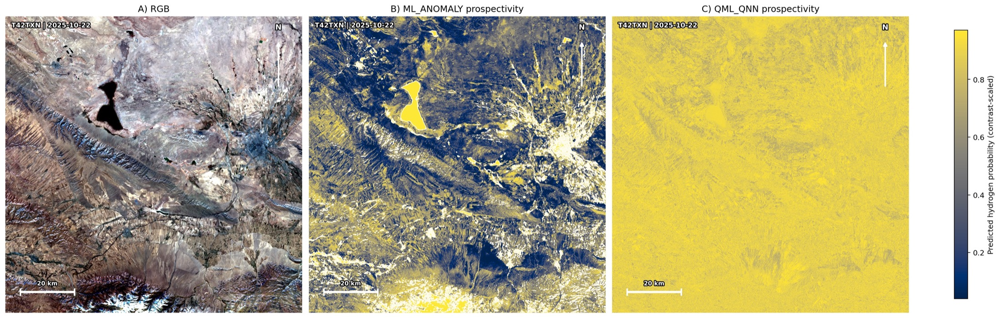
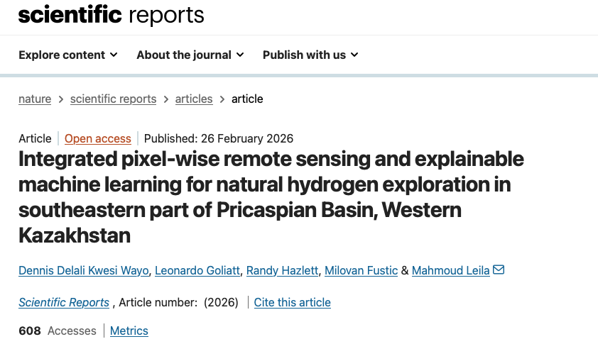

[](https://www.python.org/)
[](https://github.com/DennisWayo/XaiGis/actions/workflows/ci.yml)
[](https://pypi.org/project/xaigis/)
[](https://github.com/DennisWayo/XaiGis/releases)
[](https://doi.org/10.1038/s41598-026-41845-0)
[](https://opensource.org/licenses/MIT)

# XaiGis

## Introduction

XaiGis is a config-driven geospatial machine learning software pipeline for natural hydrogen prospectivity mapping from Sentinel-2 imagery. It converts raw SAFE products into analysis-ready feature stacks, rasterized training labels, sampled pixel datasets, trained classification models, prediction GeoTIFFs, and explainability outputs.

The software is designed for reproducible, end-to-end execution from the command line, with each stage exposed as a dedicated CLI command (`prepare`, `train`, `predict`, `explain`, `report`) and orchestrated by JSON configuration. This makes it practical both for one-off research runs and repeatable operational workflows across new areas of interest.

The framework supports both classical and quantum machine learning (QML) workflows. Classical models include SGD, Random Forest (RF), XGBoost, and LightGBM. The paper-evaluation QML workflows use PennyLane-based Variational Quantum Classifier (VQC), Quantum Neural Network (QNN), and Quantum Kernel SVM (QKernel-SVM) models.

Production-oriented implementation of the XaiGis workflow includes:
- Sentinel-2 SAFE ingestion and 10 m harmonization
- 22-feature stack generation (13 bands + 5 indices + 4 texture proxies)
- Polygon-to-raster label creation
- Pixel dataset extraction with tile-aware sampling
- Model training and evaluation (classical: SGD/RF/XGBoost/LightGBM; QML: VQC/QNN/QKernel-SVM)
- GeoTIFF probability and threshold masks
- Explainability outputs (model importances with SHAP fallback)
- Metrics and markdown reporting

## Visual Snapshot



*Illustrative scene-level output (RGB context with classical and quantum prospectivity panels).*

## Backend Software Stack

XaiGis runs as a Python CLI backend (file-based geospatial/ML pipeline). The backend stack includes:
- Language/runtime: Python (`>=3.10`)
- Geospatial processing: `rasterio`, `geopandas`
- Scientific/data stack: `numpy`, `pandas`, `scipy`
- Classical ML: `scikit-learn`, `xgboost`, `lightgbm`
- Quantum ML: `pennylane`, `autoray`
- Explainability: `shap`
- Packaging/build: `setuptools`, `wheel`

Dependency constraints are defined in `pyproject.toml`.

## Quick Start (PyPI)

```bash
mkdir -p xaigis-run && cd xaigis-run
python3 -m venv .venv
source .venv/bin/activate
python -m pip install --upgrade pip
python -m pip install xaigis
xaigis init-config --out configs/default.json
# edit configs/default.json with your local input/output paths
xaigis prepare --config configs/default.json
xaigis rasterize-labels --config configs/default.json
xaigis sample-dataset --config configs/default.json
xaigis train --config configs/default.json
xaigis predict --config configs/default.json
xaigis explain --config configs/default.json
xaigis report --config configs/default.json
```

## Development Install (from source)

```bash
cd /path/to/XaiGis
python3 -m venv .venv
source .venv/bin/activate
python -m pip install --upgrade pip
python -m pip install -e .
```

## Notes

- Update `configs/default.json` paths as needed for your local inputs.
- The pipeline is designed for large rasters and uses tile/window processing where relevant.
- `pip install xaigis` installs the full dependency set (classical ML, SHAP, and QML packages).

## Related Work Citation

If this codebase supports your work, please also cite the upstream scientific study:



```bibtex
@Article{Wayo2026,
  author  = {Wayo, Dennis Delali Kwesi and Goliatt, Leonardo and Hazlett, Randy and Fustic, Milovan and Leila, Mahmoud},
  title   = {Integrated pixel-wise remote sensing and explainable machine learning for natural hydrogen exploration in southeastern part of Pricaspian Basin, Western Kazakhstan},
  journal = {Scientific Reports},
  year    = {2026},
  month   = {Feb},
  day     = {26},
  issn    = {2045-2322},
  doi     = {10.1038/s41598-026-41845-0},
  url     = {https://doi.org/10.1038/s41598-026-41845-0}
}
```
